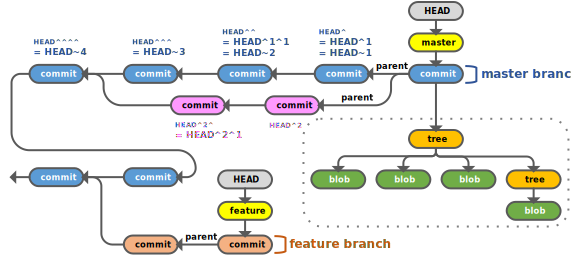
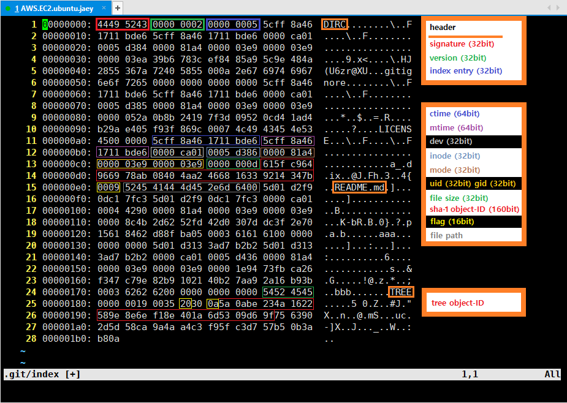

# Git Reference

---

## Dataflows

[reference](https://www.patrickzahnd.ch/blog.html)

---

## Repository
### project/.git/objects

  
This image was created by jaeyp  

---

## Index
### project/.git/index
  
This image was created by jaeyp

---

## Utilities
### decomp.py
* Decompressing object file using zlib  
* Calculating SHA-1 hash sum from decompressed data  
[code](./decomp.py)  

---

## Collaborating
[reference](https://www.atlassian.com/git/tutorials/syncing)

