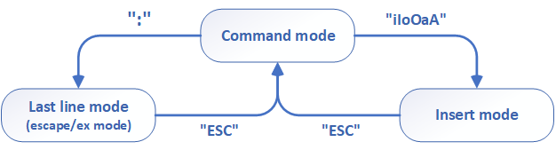

# vi/vim editor reference

## vi modes

## command mode
1. delete
> dw  
> dd  
> 5dd		- Delete current line and 4 lines below  
> D  

2. copy
> yy  
> 5yy		- Yank current line and 4 lines below  

3. paste
> p  
> P  

4. repeat
> .  

5. remove newline
> J  

6. block select
> v  
> vw  

7. indentation
> >>  
> 5>>  
> 3<<  

8. undo & redo
> u  
> Ctrl+r  

## last line mode
:q		- quit
:q!		- quit without saving changes
:w		- write
:wq		- write and quit
:line_number	- move cursor position
:$		- move to end line

## Search
/word_to_find
*		- find current word
n		- move forward
N		- move backward

## Multiple windows
:sp filename	- split screen horizontally
:vs filename	- split screen vertically
Ctrl+ww		- move to other window

## Substraction
:5,10s/a/b/g		- from 5 line to 10 line
:.,.+10s/a/b/g		- from current line to current line + 10 line
:%s/hello/world/gi	- %s: whole line, i: ignore case, g: global (substract every cases)

## Other tips
### you can issue Linux commands from within your vi editor session
:!command_name_here 	- run shell commands and returns to command mode
:!bash			- run bash keeping current editing, type 'exit' + enter to return to vi
### line number toggle
:set nonu
:set nu

